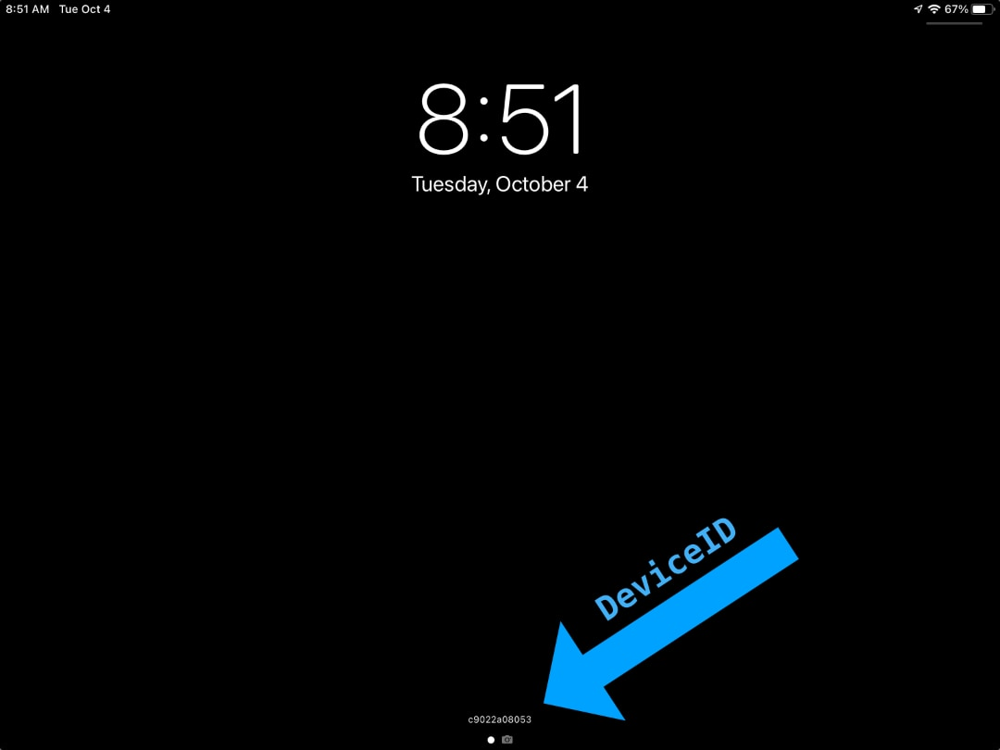

# DeviceID - iPad

### Two ways to locate DeviceID
#### Settings
~~~
Tap Settings > General > About > Name
~~~

#### Lock Screen ( super quick )
~~~
Look towards the bottom center of lock screen
~~~

